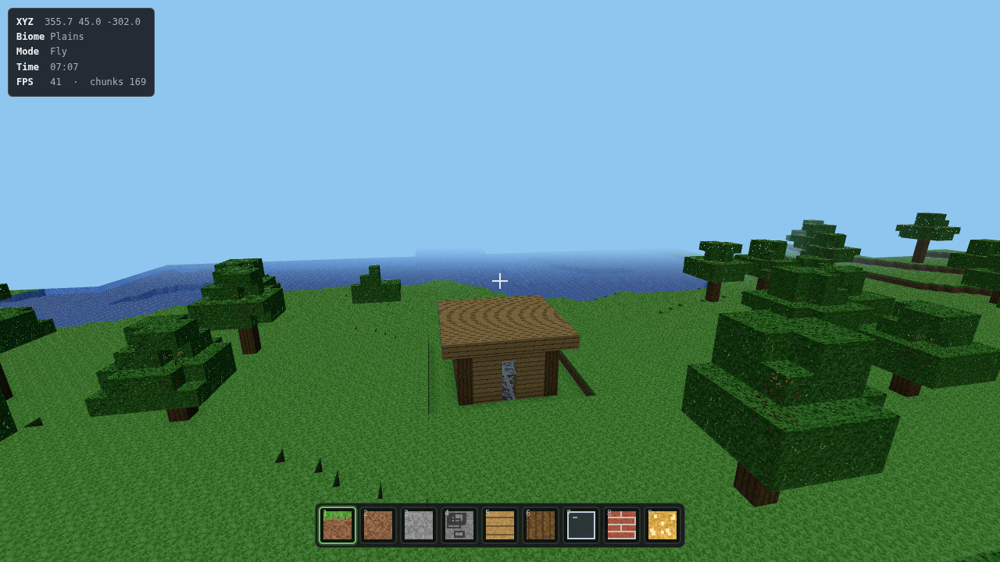

# Voxelcraft

A browser voxel sandbox in the spirit of Minecraft: an effectively infinite,
procedurally generated world you can walk through, dig into and build on.
No build step, no npm install, no image assets — every texture is painted
onto a canvas at startup, and three.js is vendored into the repo.



## Running it

ES modules can't be loaded from `file://`, so serve the folder:

```bash
node server.js          # or: npm start
```

Then open <http://localhost:8080>. Any static file server works
(`npx serve`, `python3 -m http.server`) — `server.js` is just a
dependency-free convenience.

## Controls

| Input | Action |
| --- | --- |
| `W` `A` `S` `D` | Move |
| Mouse | Look (click the canvas to capture the pointer) |
| Left click | Break block — hold to keep mining |
| Right click | Place the selected block |
| Middle click | Copy the block you're aiming at into the hotbar |
| `Space` | Jump — double-tap to toggle flight |
| `Shift` | Sneak, or descend while flying |
| `Ctrl` | Sprint |
| `1`–`9`, scroll | Select hotbar slot |
| `E` | Block palette (27 blocks) |
| `F` | Toggle flight |
| `R` | Respawn on the surface |
| `Esc` | Pause |

## What's in it

- **Infinite terrain** — layered Perlin noise drives continents, hills and
  mountains; chunks stream in and out around you as you walk.
- **Five biomes** — plains, forest, desert, tundra and mountains, chosen by
  temperature/humidity fields, each with its own surface blocks and features.
- **Caves and ores** — tunnels are carved by intersecting 3D noise fields;
  coal, iron, gold and diamond appear in depth-dependent bands.
- **Oceans** — anything below sea level fills with translucent water you can
  swim in, with an underwater tint and its own fog.
- **27 block types** with break/place, baked ambient occlusion, and separate
  opaque / alpha-cutout / water render passes.
- **Day/night cycle** with a moving sun and sky, horizon and fog colours that
  shift through dawn and dusk.
- **Persistence** — worlds save to `localStorage` automatically every 30s.
  Only the blocks you changed are stored; the rest is regenerated from the
  seed, so a heavily edited world is still a few kilobytes.

## How it works

```
js/config.js    chunk dimensions and tunables (render distance, reach)
js/noise.js     seeded Perlin noise + fBm helpers
js/blocks.js    block registry and the procedurally painted texture atlas
js/worldgen.js  height, biome, cave, ore and feature generation
js/mesher.js    chunk blocks -> BufferGeometry, face culling + vertex AO
js/world.js     chunk storage, streaming, edits, voxel raycast, persistence
js/player.js    AABB physics, walking/swimming/flying, mouse look
js/main.js      renderer, sky, HUD, input, game loop
```

Two ideas do most of the heavy lifting:

**Chunks.** The world is split into 16×16×96 columns stored as flat
`Uint8Array`s. Only chunks within the render distance are meshed, and each
chunk becomes up to three meshes — opaque, alpha-cutout (leaves, glass) and
water — so transparency sorts correctly without splitting draw calls per
block. Meshing emits only faces whose neighbour is non-opaque, then bakes an
ambient-occlusion value into each vertex colour, which is what gives corners
and overhangs their depth without any runtime lighting cost.

**Generation is a pure function.** Terrain depends only on `(seed, x, y, z)`,
so a chunk can be thrown away and rebuilt identically at any time. That makes
saving cheap: the game stores a map of player edits per chunk and replays them
over freshly generated terrain on load.

## Tuning

`js/config.js` holds the knobs worth touching first:

```js
renderDistance: 6,   // chunks in every direction; 4 for slow machines, 10+ for fast ones
reach: 6,            // how far you can break/place, in blocks
chunkBudgetMs: 8,    // per-frame time budget for generating and meshing
```

## Limitations

This is a voxel sandbox, not a Minecraft clone. There are no mobs, no
crafting, no inventory management, no redstone, no multiplayer, and no
survival mechanics — all blocks are available from the palette, creative
style. Lighting is directional plus ambient occlusion; there's no propagating
block light, so glowstone looks bright but doesn't actually illuminate a cave.

## License

MIT. three.js is bundled under `vendor/` with its own MIT license.
